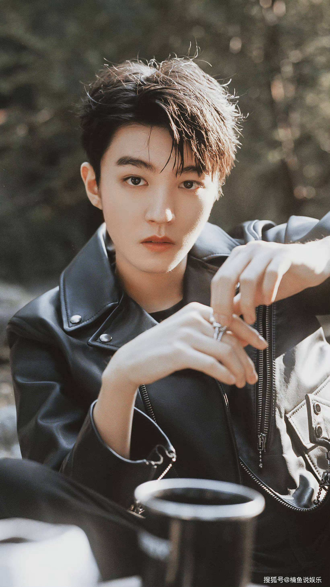
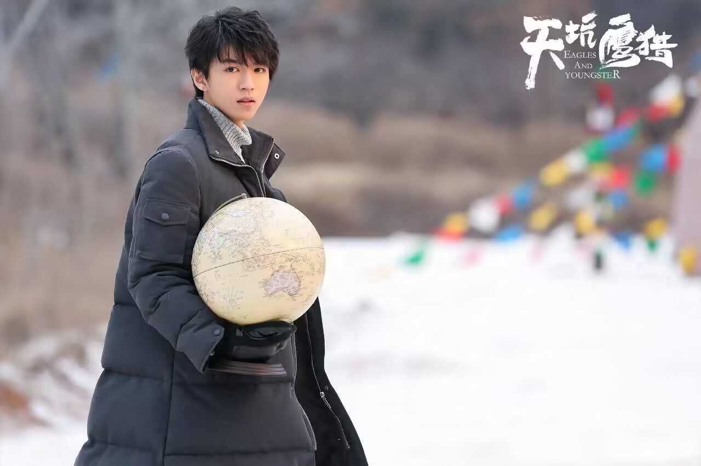
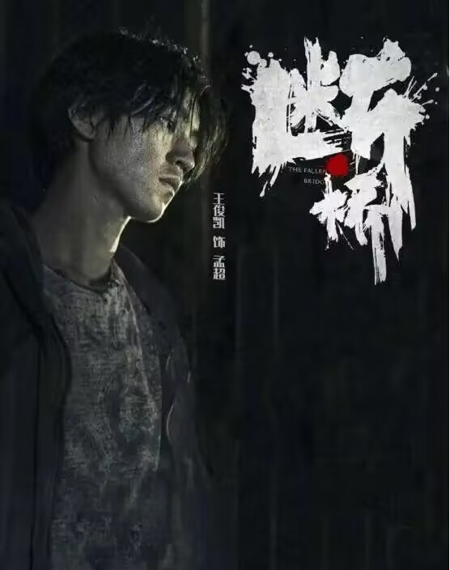
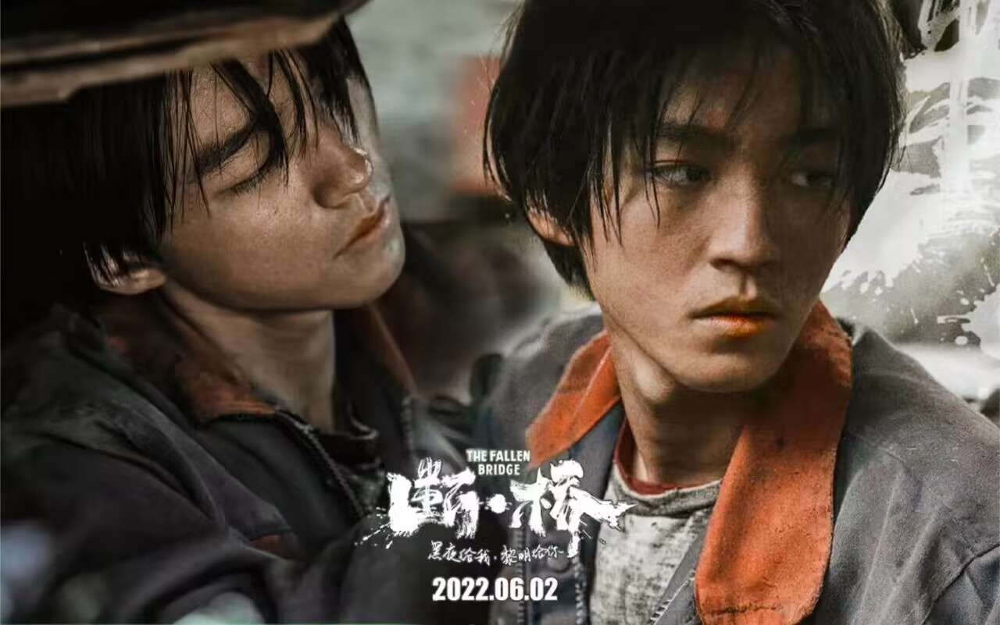

### 王俊凯个人介绍

#### 基本信息

王俊凯，1999年9月21日出生于重庆市，中国内地流行乐男歌手、影视演员，中国男子演唱组合TFBOYS队长，毕业于北京电影学院2017级表演系本科班。

|          |                              |          |                              |
| :------: | ---------------------------- | :------: | ---------------------------- |
|  中文名  | 王俊凯                       |   职业   | 歌手、演员                   |
|  外文名  | Karry                        | 队内职务 | 队长                         |
|   别名   | 小凯、大哥、凯宝、凯爷、俊俊 | 粉丝名称 | 小螃蟹                       |
|   国籍   | 中国                         |  应援色  | 蓝色                         |
|   民族   | 汉族                         |   特长   | 唱歌、跳舞、表演、吉他、乐器 |
|  出生地  | 重庆市九龙坡区               | 公益基金 | 焕蓝梦想公益基金             |
| 出生日期 | 1999年9月21日                |   生肖   | 兔                           |
|   星座   | 处女座                       |  工作室  | 王俊凯KarryWang工作室        |

#### 行程与荣誉

- 2010年底，加入TF家族。

- 2012年2月，通过网络翻唱歌曲《囚鸟》走进大众视野。

- 2013年8月6日，与王源、易烊千玺组成组合TFBOYS正式出道，王俊凯担任组合队长 。

- 2015年5月，参加共青团中央优秀青年座谈会；7月，参加“中华全国学生联合会第26次代表大会”。

- 2016年2月，登上2016年中央电视台春节联欢晚会 ；8月，推出个人原创单曲*《树读》*。

  ***《树读》戳这里***【【王俊凯】 树读】https://www.bilibili.com/video/BV1Ks411k7zc?vd_source=a1f99996a9fb4f142e6d73bf7b8e0c11

- 2017年1月，登上2017年中央电视台春节联欢晚会 ；其后，成立个人公益“焕蓝梦想公益基金”；12月，获得《中国新闻周刊》“影响中国”年度演艺人物奖 。

- 2018年4月，被联合国环境规划署任命为“联合国环境署亲善大使” ；8月，主演的自然题材励志剧*《天坑鹰猎》*在优酷网播出，他在剧中饰演张保庆。该剧在优酷网播放总量突破41亿，并于同年9月在东方卫视上星播出。

  

- 2019年，王俊凯在北京凯迪拉克中心举办首场*“无边界”个人演唱会* ；同年，担任“2019年APEC未来之声青年大使” ，并凭借奇幻片《解忧杂货店》中小波一角，获得第17届中国电影表演艺术学会奖新人奖 。

  ***“无边界”演唱会戳这里***【【王俊凯】2019年无边界个人演唱会全程（字幕版）】https://www.bilibili.com/video/BV1d7411K7FS?vd_source=a1f99996a9fb4f142e6d73bf7b8e0c11

- 2020年1月，登上2020年中央电视台春节联欢晚会 。

- 2021年2月11日，参加《2021年中央广播电视总台春节联欢晚会》，演唱歌曲《瑞雪平安图》。

- 2022年2月2日，参加《百花迎春》晚会，演唱歌曲《灯火里的中国》。6月2日上映电影*《断桥》*。10月2日16时，主演作品票房突破25亿。

  

  

#### 小凯的舞台高光时刻

1. 《摩天轮的思念》【【王俊凯】摩天轮的思念1080】https://www.bilibili.com/video/BV16K411P7p4?vd_source=a1f99996a9fb4f142e6d73bf7b8e0c11
2. 《我的秘密》《突然好想你》（*巨巨巨好听）*【【BelovedGlory王俊凯荣光站】我的秘密&突然好想你-王俊凯】https://www.bilibili.com/video/BV1LW411S7uT?vd_source=a1f99996a9fb4f142e6d73bf7b8e0c11
3. 《词不达意》【【王俊凯】《词不达意》七机位.Ver -王俊凯恶魔站】https://www.bilibili.com/video/BV1WE411v7Qb?vd_source=a1f99996a9fb4f142e6d73bf7b8e0c11
4. 《beautiful》【【王俊凯】伪·王俊凯《beautiful》打歌舞台现场，是最闪耀的哥哥】https://www.bilibili.com/video/BV19D4y1d7bb?vd_source=a1f99996a9fb4f142e6d73bf7b8e0c11

#### 小凯励志名言

1、人生需要努力，年轻没有极限！—— 王俊凯

2、妈妈说，如果梦想有条捷径的话，那么这条路的名字一定叫坚持。我想如果从8岁开始，坚持一件事情那么到18岁，不成功都没有道理。 —— 王俊凯

3、感谢你给我的光荣，那个少年曾经多普通，是你让我把梦做到最巅峰。—— 王俊凯

4、穿着永远干净却略显宽松的校服，有着黑色柔顺的短发，清瘦的身材，明亮的眸子，笑的时候仿佛世界都洒满阳光。—— 王俊凯

5、你喜欢王俊凯吗，喜欢的话，就来看一看王俊凯关于励志的名言警句吧。从王俊凯的身上，学习他顽强拼搏的精神，做一个励志的人。分享王俊凯励志名言警句，为有梦想的你，助力，加油。

6、时间总是过得很快，可我总想留住些什么，证明些什么。—— 王俊凯

7、如果世界不再绚丽，那么凯的出现，便是我重生的希望。—— 王俊凯

8、就是希望，自己的实力越来越好吧。就是，可以保护那些在乎我的人。虽然人生没有绝对，但我仍然相信会有像水一样纯净透彻的标准。—— 王俊凯

9、盛夏的午后，草在结它的种子，风在摇它的叶子。少年站着，不说话，就十分美好。他是从未出现的风景，是年少时的梦。—— 王俊凯

10、王源的成功不是偶然，但你若能如王源一样励志，希望努力，你也可以。关于王源励志的名言警句，送给你，在追逐梦想的路上，坚持到底，你可以的。

11、笑意不减当初，傲气更胜往日。渐行渐远的少年，请你慢些走，在纷繁陆离的世界中，愿你不负此行。—— 王俊凯